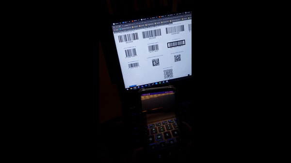
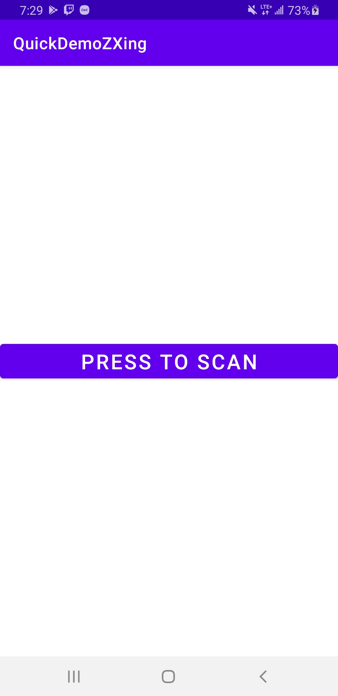
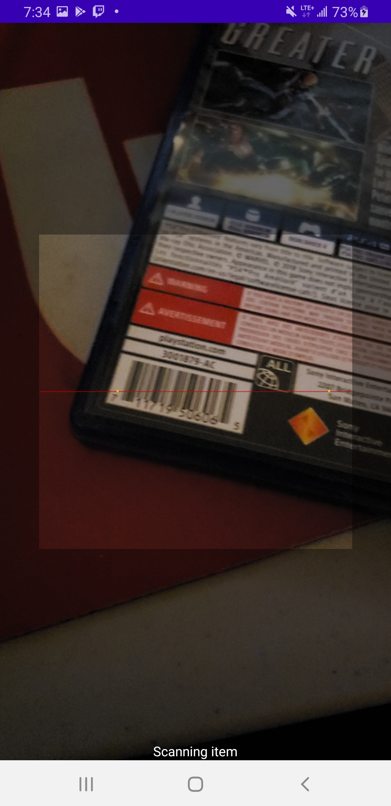
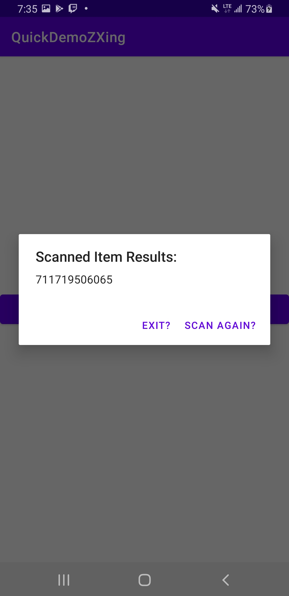

# README

## How to create a barcode/QR scanner using ZXing

Create a new project 
Install new libraries

Gradle App level - Add a new dependency
    
     implementation 'com.journeyapps:zxing-android-embedded:3.4.0'
     
Then sync your gradle file.

You will also want to add permissions to your manifest file.

In this case, add the permission to use the camera.

This is needed in order to actaully scan the barcodes

    <uses-permission android:name="android.permission.CAMERA" />
    <uses-feature android:name="android.hardware.camera" />
    <uses-feature android:name="android.hardware.camera.autofocus" />

        
## Research / Useful Learning Resources

https://zxing.github.io/zxing/apidocs/com/google/zxing/integration/android/IntentIntegrator.html

https://www.youtube.com/watch?v=wfucGSKngq4

https://developer.android.com/guide/topics/manifest/activity-element#state

https://developer.android.com/reference/android/app/AlertDialog

https://stackoverflow.com/questions/35993253/while-using-the-intentintegrator-from-the-zxing-library-can-i-add-a-flash-butto

